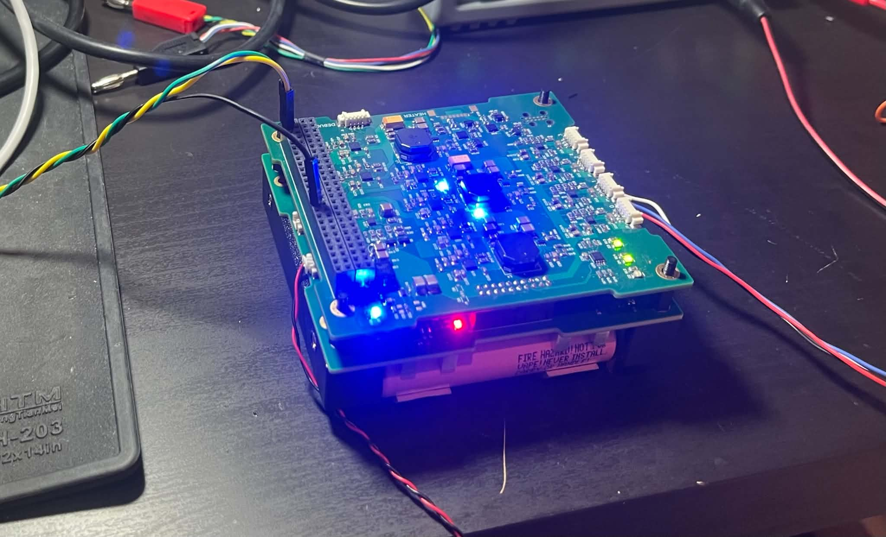
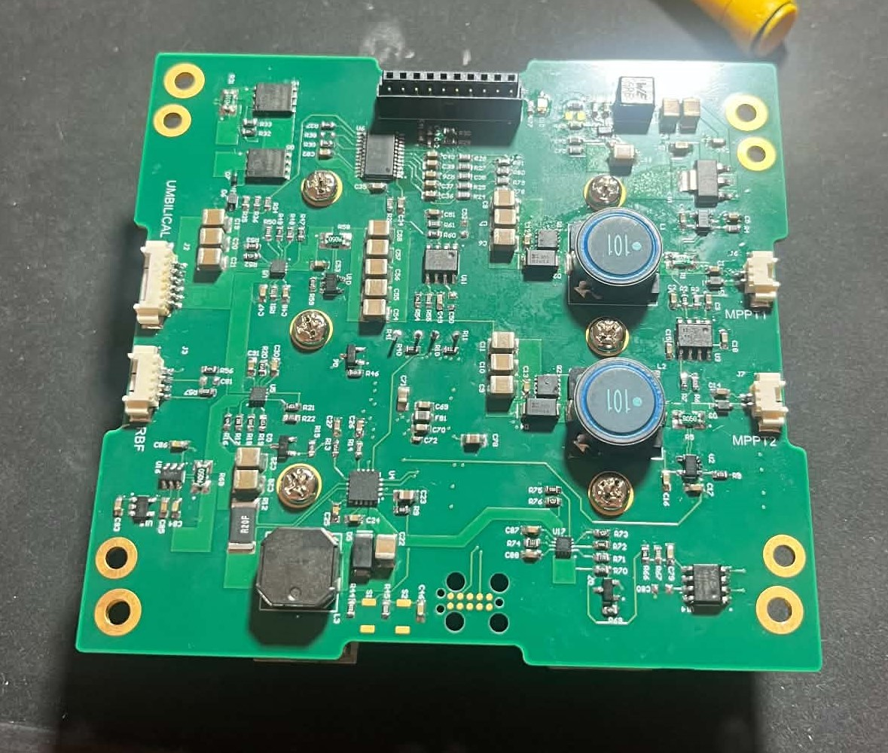
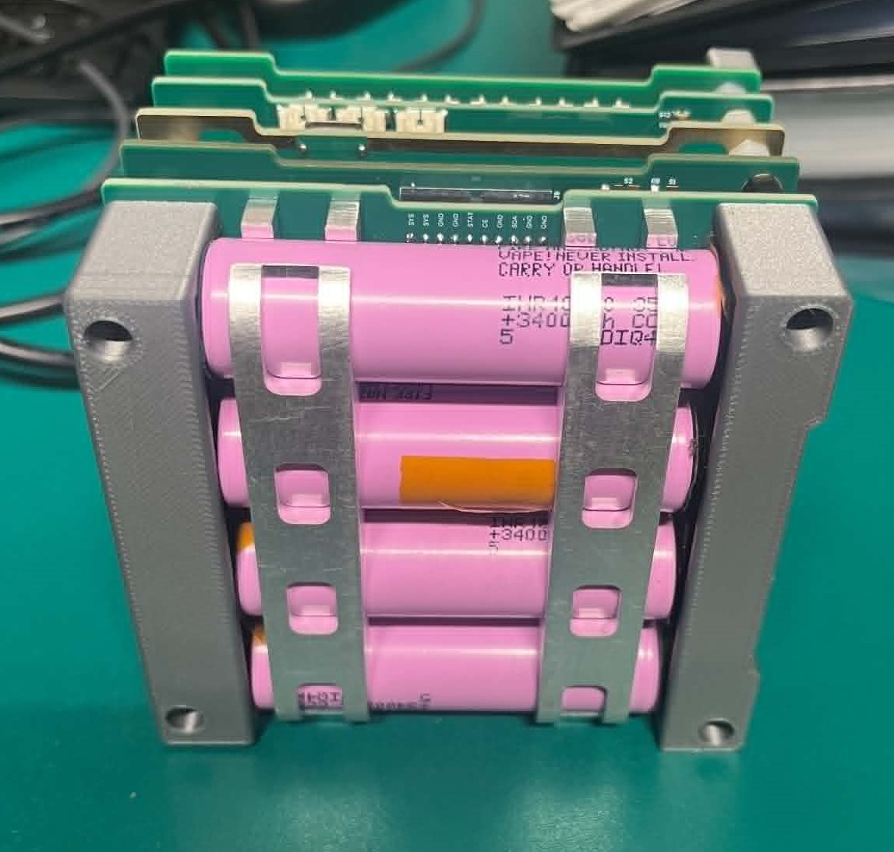

# CubeSat EPS

Electrical Power System (EPS) hardware and firmware for a Docker-1 Cubesat. The project contains Altium projects and embedded firmware for the two EPS PCBs: The Battery Management System (BMS) and the Power Distribution Module (PDM).

## Overview
The EPS is comprised of two boards:
- **BMS — Battery Management System**: Contains a 4S Li-Ion battery directly soldered to the PCB. Performs battery protection, battery seperation, umbilical charging and solar panel charging via two MPPT boost circuits.


- **PDM — Power Distribution Module**: Regulates the raw battery voltage from the BMS to the voltages required by other subsystems on the satellite.

The firmware is written primarily in C for STM32 microcontrollers, with Python utilities for CAN communication, telemetry monitoring, plotting, and test automation.

## Repository Structure

```text
CubesatEPS/
├── CAD/                  # Mechanical/CAD assets
├── Software/             # Firmware and Python support tools
│   ├── BMS/              # STM32 BMS firmware project
│   ├── BMS_Test/         # BMS test firmware/software
│   ├── PDM/              # PDM firmware, CAN tools, telemetry scripts
│   └── control_panel.py  # Simple serial control utility
├── core/                 # Shared or generated core project files
├── hardware/             # PCB design files
│   ├── BMS/              # BMS Altium hardware project files
│   └── PDM/              # PDM Altium hardware project files
└── .gitignore
```

## Main Features

### Battery Management System

- Battery protection and power-path control
- Solar input regulation and MPPT control
- Umbilical charging interface
- ADC-based telemetry acquisition
- STM32Cube/PlatformIO firmware project
- ST-Link upload and debug support

### Power Distribution Module

- Regulated spacecraft power rails
- Protected load switching/eFuse control
- Voltage and current telemetry
- CAN-based command and telemetry interface
- Python tools for listening to, decoding, and plotting EPS telemetry

### Software Tooling

- STM32Cube-generated firmware structure
- PlatformIO build support for the BMS firmware
- Python CAN controller/listener utilities
- JSON-based command and conversion definitions
- Live plotting scripts for power rail current testing

## Hardware

The hardware design files are stored under:

```text
hardware/BMS/
hardware/PDM/
```

These folders contain the PCB design files for the battery management and power distribution boards. The project appears to use Altium Designer project/schematic/PCB file formats.

## Firmware

The main BMS firmware project is located at:

```text
Software/BMS/
```

The BMS firmware uses:

- STM32Cube framework
- STM32F446RE target
- PlatformIO project configuration
- ST-Link for upload/debug

### Building the BMS Firmware

From the BMS firmware directory:

```bash
cd Software/BMS
pio run
```

### Uploading to the MCU

```bash
pio run --target upload
```

### Debugging

```bash
pio debug
```

## Python Utilities

Python scripts are stored mainly in:

```text
Software/PDM/
Software/control_panel.py
```

These tools support:

- Sending EPS commands
- Listening to CAN telemetry
- Applying telemetry conversions
- Plotting rail current measurements
- Basic serial register reads

Install the likely required Python packages with:

```bash
pip install pyserial python-can matplotlib pandas
```

Some scripts may require editing the serial/CAN interface configuration before use.

## Typical Development Workflow

1. Modify the hardware design in the relevant `hardware/BMS` or `hardware/PDM` project.
2. Update firmware in `Software/BMS` or `Software/PDM`.
3. Build and flash firmware using PlatformIO or STM32Cube tooling.
4. Use the Python tools to send commands, monitor telemetry, and validate rail behaviour.
5. Record and analyse telemetry/current data during bench testing.

## Safety Notes

This project involves spacecraft power electronics, battery charging, high-current rails, and protected power distribution. When testing:

- Use a current-limited bench supply.
- Validate rail voltages before connecting flight or expensive loads.
- Confirm battery polarity and protection settings before charging.
- Avoid hot-plugging boards unless the design explicitly supports it.
- Treat early firmware as unsafe until protection paths are verified on hardware.

## Suggested Improvements

Useful future additions to this README would include:

- System block diagram
- Rail voltage/current table
- CAN message map
- Battery pack configuration
- MPPT operating limits
- Bring-up checklist
- Test procedure for BMS and PDM boards
- Known hardware revisions and errata

## Status

This repository is under active development. Interfaces, firmware structure, telemetry formats, and hardware revisions may change as the EPS design matures.

## Author

Developed by Tom Holland / Ahristi as part of a CubeSat Electrical Power System project.
