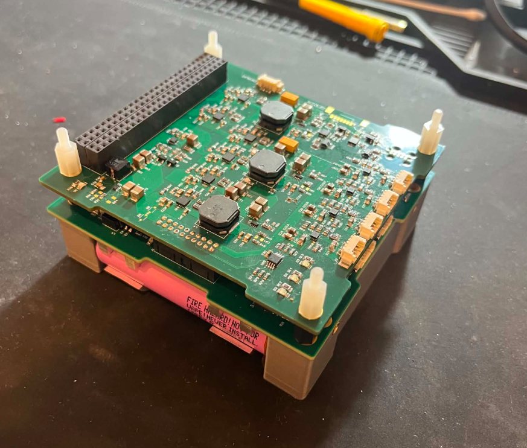
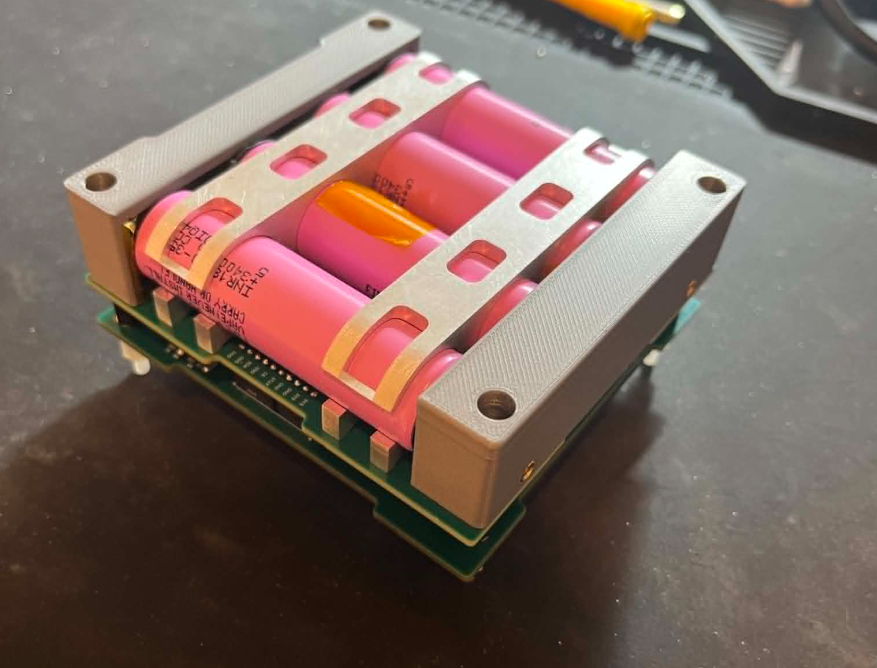
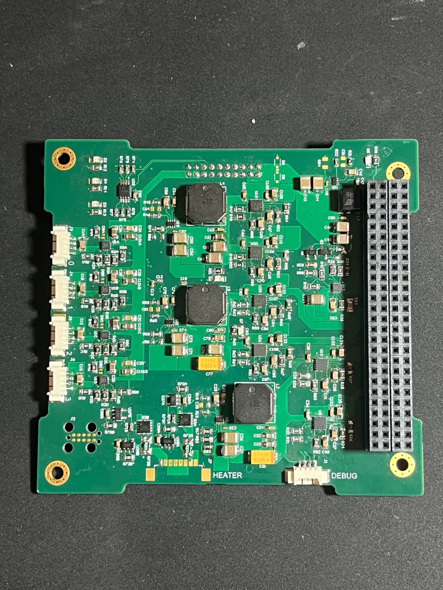
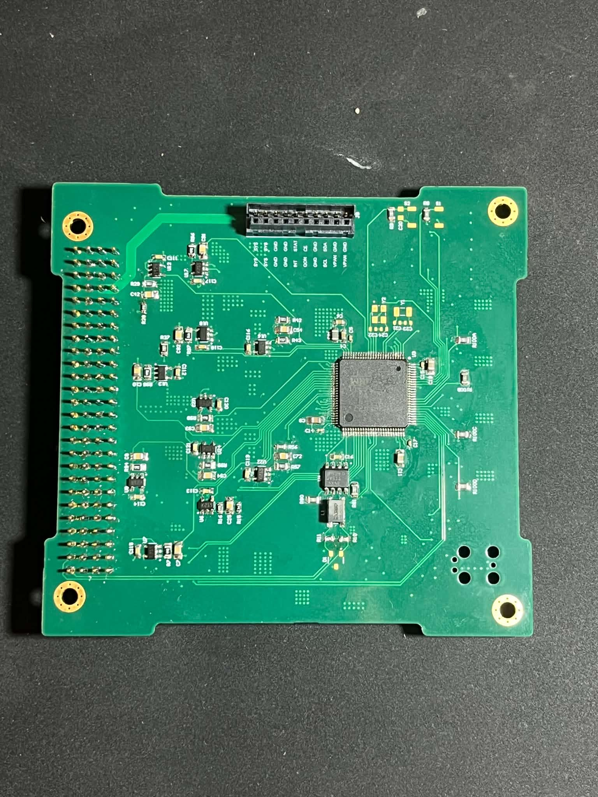

# CubeSat EPS

Electrical Power System (EPS) hardware and firmware for a Docker-1 Cubesat. The project contains Altium projects and embedded firmware for the two EPS PCBs: The Battery Management System (BMS) and the Power Distribution Module (PDM).
<table>
  <tr>
    <td align="center">
      <br>
      <b>EPS Assembly top view</b>
    </td>
    <td align="center">
      <br>
      <b>EPS Assembly bottom view</b>
    </td>
  </tr>
</table>
## Overview
The EPS is comprised of two boards:
- **BMS — Battery Management System**: Contains a 4S Li-Ion battery directly soldered to the PCB. Performs battery protection, battery seperation, umbilical charging and solar panel charging via two MPPT boost circuits.
<table>
  <tr>
    <td align="center">
      <br>
      <b>BMS PCB</b>
    </td>
    <td align="center">
      <br>
      <b>Battery Pack</b>
    </td>
  </tr>
</table>

- **PDM — Power Distribution Module**: Regulates the raw battery voltage from the BMS to the voltages required by other subsystems on the satellite.
<table>
  <tr>
    <td align="center">
      <br>
      <b>BMS PCB</b>
    </td>
    <td align="center">
      <br>
      <b>Battery Pack</b>
    </td>
  </tr>
</table>

The firmware for the PDM is an STM32 eclipse project. With code generated using HAL libraries from CubeMX. The firmware for the BMS is a platformIO project, with code also generated from STM32CubeMX

## Repository Structure

```text
CubesatEPS/
├── CAD/                  # Mechanical/CAD assets
├── Software/             # Firmware and Python support tools
│   ├── BMS/              # STM32 BMS firmware project
│   ├── BMS_Test/         # BMS test firmware/software
│   ├── PDM/              # PDM firmware, CAN tools, telemetry scripts
│       ├──  PDM/         # STM32 project for PDM
|       └──  EPS_gui.py   # Python script used to monitor EPS CAN telemetry and turn eFuses on/off.
├── hardware/             # PCB design files
│   ├── BMS/              # BMS Altium hardware project files
│   └── PDM/              # PDM Altium hardware project files
└── .gitignore
```

## Main Features

### Battery Management System

- Battery protection and power-path control
- Solar input regulation and MPPT control
- Umbilical charging interface
- ADC-based telemetry acquisition
- STM32Cube/PlatformIO firmware project
- ST-Link upload and debug support

### Power Distribution Module

- Regulated spacecraft power rails
- Protected load switching/eFuse control
- Voltage and current telemetry
- CAN-based command and telemetry interface
- Python tools for listening to, decoding, and plotting EPS telemetry

### Software Tooling

- STM32Cube-generated firmware structure
- PlatformIO build support for the BMS firmware
- Python CAN controller/listener utilities
- JSON-based command and conversion definitions
- Live plotting scripts for power rail current testing

## Hardware

The hardware design files are stored under:

```text
hardware/BMS/
hardware/PDM/
```

These folders contain the Altium projects for battery management and power distribution boards.
## Known Issues
- Battery current measurement is a quite poor. This is because the current measurement instrumentation amplifier is backfeeding current to the 1.5V reference which causes the reference to rise to about 2.4V. This needs to be fixed by adding a lower output impedance bbuffer ont he output of the LDO.
- PDM 6V enable MOSFET circuit is incorrect. R33 should be pulled directly to 5V5. This was fixed by a small rework on the board, but should be fixed in the next revision.
- Legacy GPIOs on the mezzanine connector which do nothing currently. This were to ensure backwards compatibility with old V1 hardware but aren't used anymore.
- Heater driver is currently untested as we didn't use it in the end for the DOCKER-1 project.

## Future improvements
- I2C is a bit finnicky for the PDM to BMS link. In a future revision I would probably change it to be directly on the CANbus.
- Ideal diodes on the PDM are legacy hardware that are unused as MPPT is done directly on the BMS. Previously on the V1 of the BMS, the BMS contained a single MPPT circuit and these ideal diodes would output whichever panel was the most illuminated.
- Change the buck converter ICs from TPS6993 to AP64501. I was planning on doing this in a second revision of the PDM but unfortunately ran out of time since I had 5 other PCBs to design for the satellite.
- If you have to do one thing I beg you to replace all the PDM efuses with TPS25497. The TPS16410 that I used for all the PDM outputs (except for the 6V output) is a piece of shit and really hard to solder. The TPS25947 is marginally more expensive, but has a higher current rating and reverse current blocking. We had some issues plugging USBs into boards downstream using the TPS16410. The TPS25947 is much easier to solder as well from my experience.


## Author

Developed by Tom Holland / Ahristi as part of the DOCKER-1 project for AERO4701 at the University of Sydney
